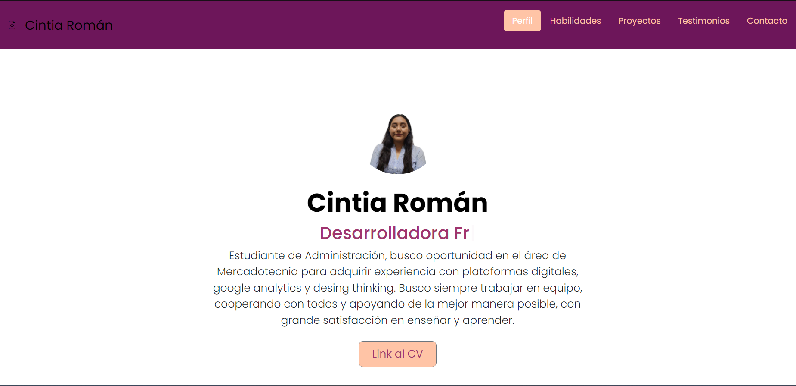

## Portafolio de proyectos

¡Hola! *Soy Cintia Roman*, soy asistente administrativo, desarrolladora web junior y estudiante de análisis de datos, apasionada por la tecnología, aquí encontrarás información sobre mí.

_______
### El proyecto cuenta con las secciones de:

- 🛠️ Habilidades 
- 📆 Proyectos
- 👩‍🦰 Testimonios
- ✉️ Contacto

### Creado con:
- HTML

- CSS

- JavaScript

_________

### Vista Previa

### **Espero pronto saber de ti**
*Correo*
[cinromanclass@outlook.com](mailto:cinromanclass@outlook.com)

_____

### Creado en el bootcamp de TecnolochicasPro 💜
[Tecnolochicas](https://tecnolochicas.mx)